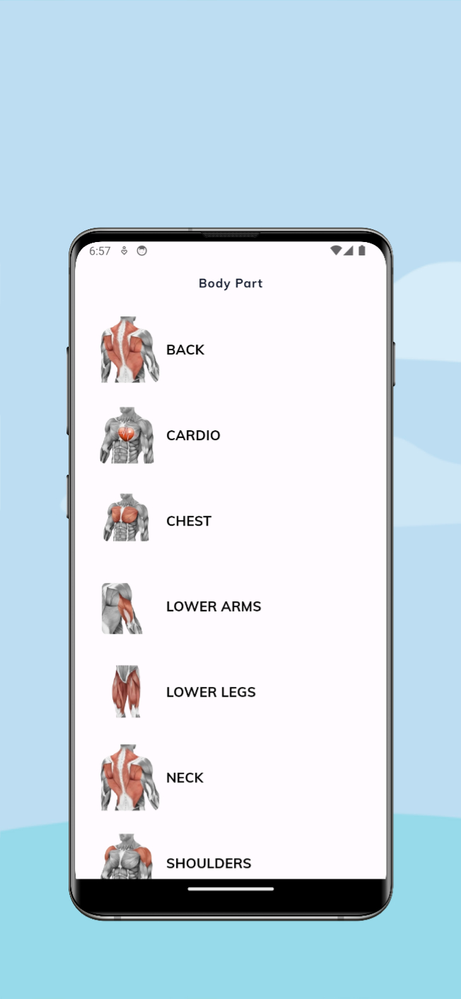
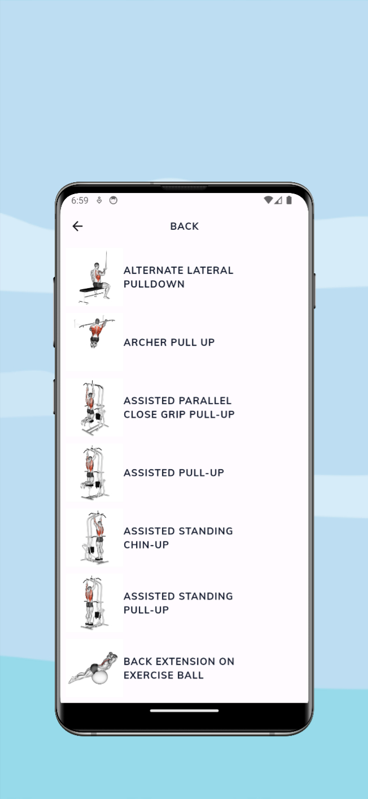
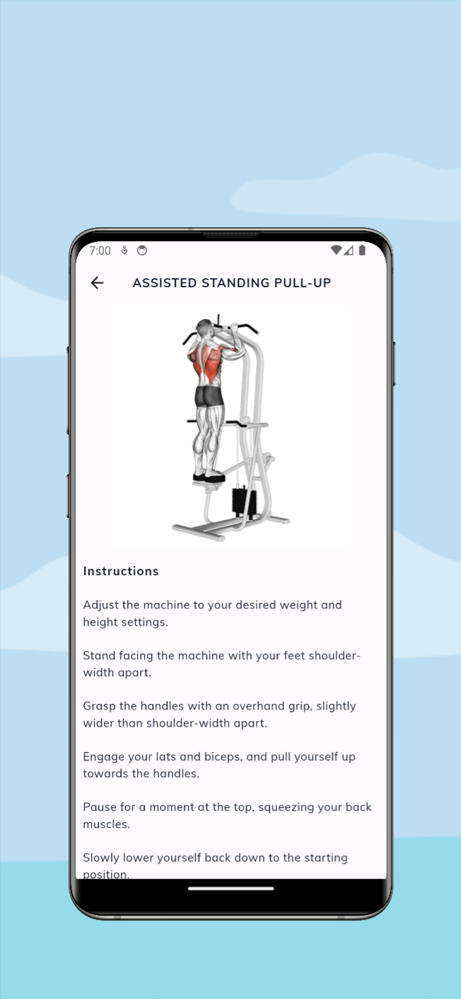

<div align="center">
<h1 align="center">

<br>flutter-app-fitfolio</h1>

<p align="center">


</p>

</div>

---

## 📂 Repository Structure

```sh
└── flutter-app-fitfolio/
    ├── .env
    ├── .gitignore
    ├── .metadata
    ├── 1.jpeg
    ├── 2.jpeg
    ├── 3.jpeg
    ├── README.md
    ├── analysis_options.yaml
    ├── android/
    │   ├── .gitignore
    │   ├── app/
    │   ├── build.gradle
    │   ├── gradle/
    │   ├── gradle.properties
    │   └── settings.gradle
    ├── assets/
    │   ├── fonts/
    │   ├── icon/
    │   ├── images/
    │   └── search_icon.svg
    ├── flutter_native_splash.yaml
    ├── ios/
    │   ├── .gitignore
    │   ├── Flutter/
    │   ├── Podfile
    │   ├── Podfile.lock
    │   ├── Runner/
    │   ├── Runner.xcodeproj/
    │   ├── Runner.xcworkspace/
    │   └── RunnerTests/
    ├── lib/
    │   ├── app.dart
    │   ├── core/
    │   ├── data/
    │   ├── initializer.dart
    │   ├── main.dart
    │   ├── modules/
    │   ├── routes/
    │   └── shared/
    ├── linux/
    │   ├── .gitignore
    │   ├── CMakeLists.txt
    │   ├── flutter/
    │   ├── main.cc
    │   ├── my_application.cc
    │   └── my_application.h
    ├── macos/
    │   ├── .gitignore
    │   ├── Flutter/
    │   ├── Podfile
    │   ├── Runner/
    │   ├── Runner.xcodeproj/
    │   ├── Runner.xcworkspace/
    │   └── RunnerTests/
    ├── pubspec.lock
    ├── pubspec.yaml
    ├── web/
    │   ├── favicon.png
    │   ├── icons/
    │   ├── index.html
    │   └── manifest.json
    └── windows/
        ├── .gitignore
        ├── CMakeLists.txt
        ├── flutter/
        └── runner/
```

---

# Screenshot





## 🚀 Getting Started

**_Dependencies_**

Please ensure you have the following dependencies installed on your system:

### 🔧 Installation

1. Clone the flutter-app-fitfolio repository:

```sh
git clone https://github.com/badiniibrahim/flutter-app-fitfolio.git
```

2. Change to the project directory:

```sh
cd flutter-app-fitfolio
```

3. Install the dependencies:

```sh
pub get
```

### 🤖 Running flutter-app-fitfolio

```sh
dart main.dart
```

### 🧪 Tests

```sh
dart test
```

## 📄 License

This project is licensed under the `ℹ️  LICENSE-TYPE` License. See the [LICENSE-Type](LICENSE) file for additional info.

---

## 👏 Acknowledgments

`- ℹ️ List any resources, contributors, inspiration, etc.`

[↑ Return](#Top)

---
